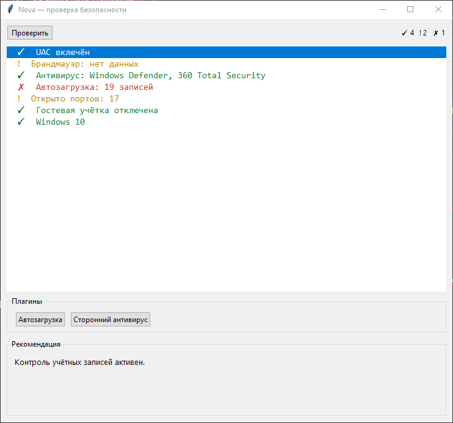

# Nova

**Лёгкий помощник для поиска уязвимостей и слабых мест в ОС.**
Без прав администратора — только чтение системных параметров и безопасные пользовательские правки.



## Возможности

- 7 встроенных проверок: UAC, брандмауэр, антивирус, автозагрузка, открытые порты, гостевая учётка, версия Windows.
- Плагинная система: чистка автозагрузки, поиск сторонних антивирусов.
- Все правки — с резервными копиями в `plugins/_backup/`.
- Работает на Windows без прав администратора.

## Требования

- Windows 10 / 11
- Python 3.10+ (только для запуска из исходников)

## Запуск из исходников

```bash
git clone https://github.com/aleks228ter/Nova-Project.git
cd Nova-Project
python Nova.py
```

## Сборка .exe

```bash
cd builder
python build.py
```

Готовый файл появится в `dist/Nova.exe`.

## Плагины

Плагин — это `.py`-файл в папке `plugins/` с тремя элементами:

```python
PLUGIN = {"name": "...", "description": "..."}
def scan() -> list[dict]: ...
def fix(issue_id: str) -> tuple[bool, str]: ...
```

## Лицензия

MIT — см. [LICENSE](LICENSE).
